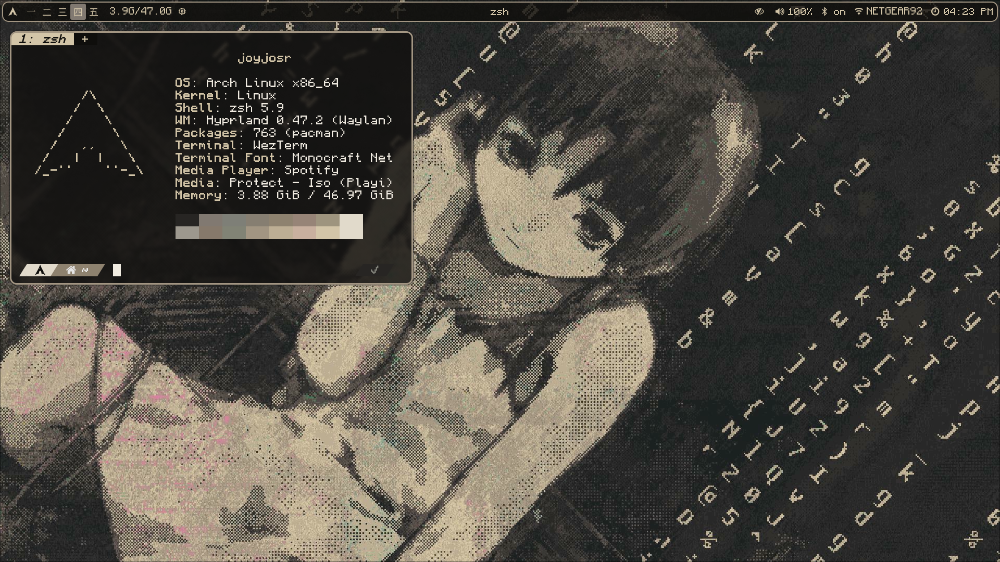
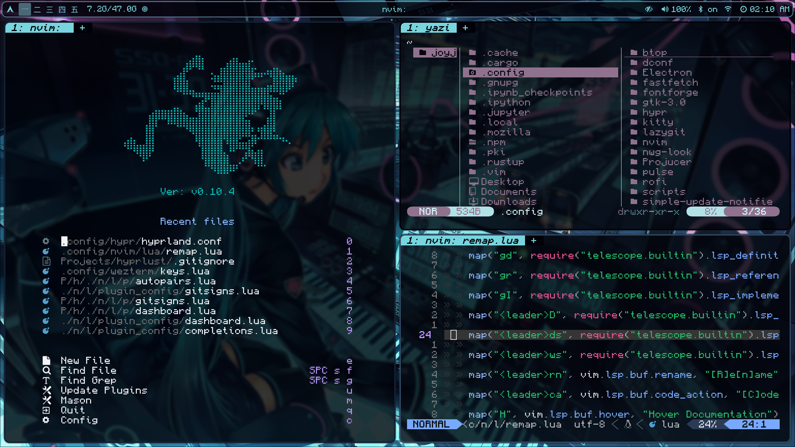
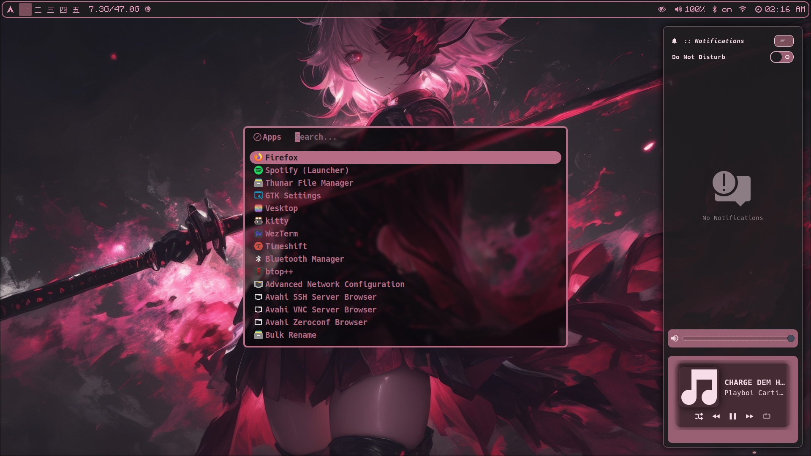
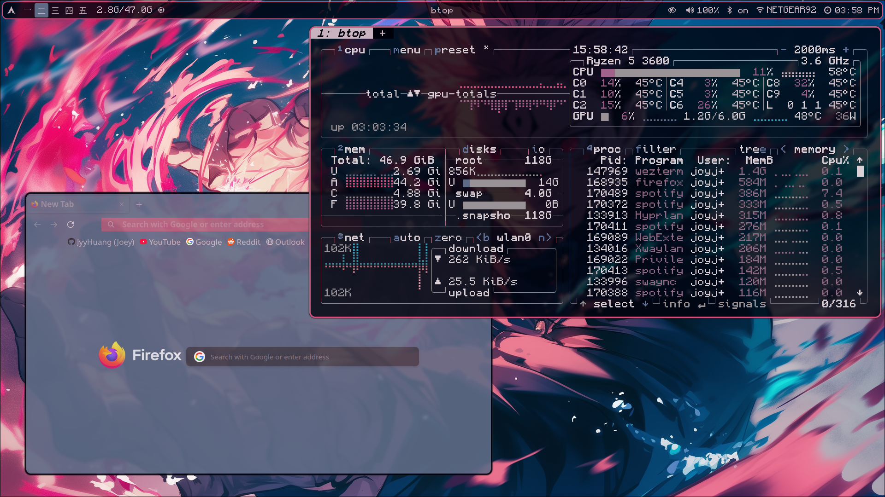
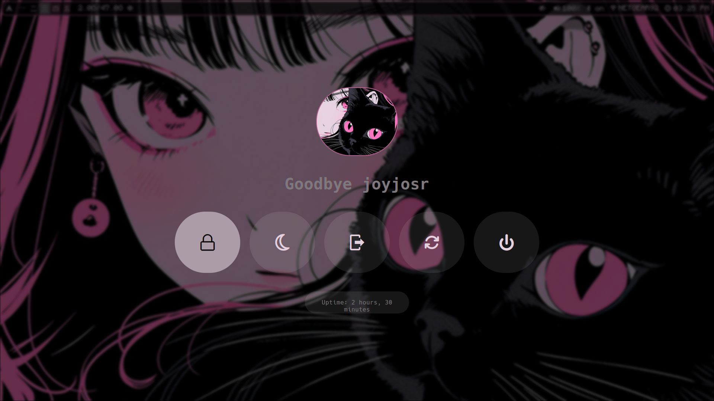
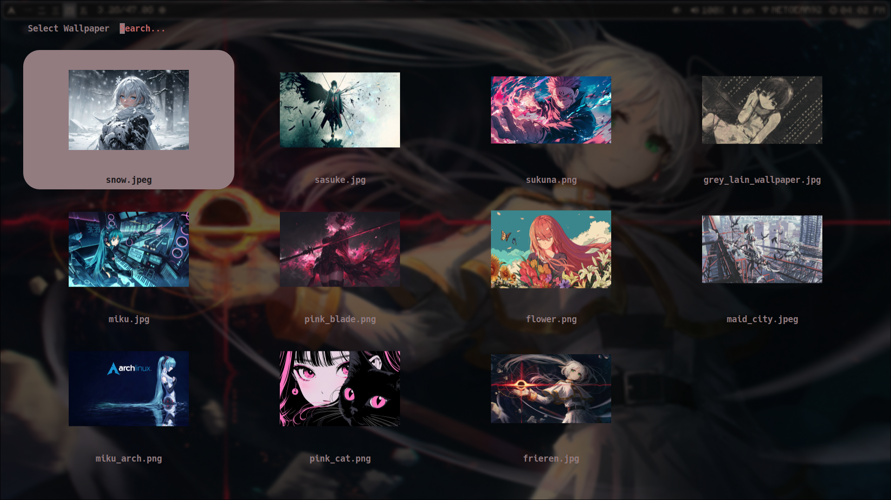
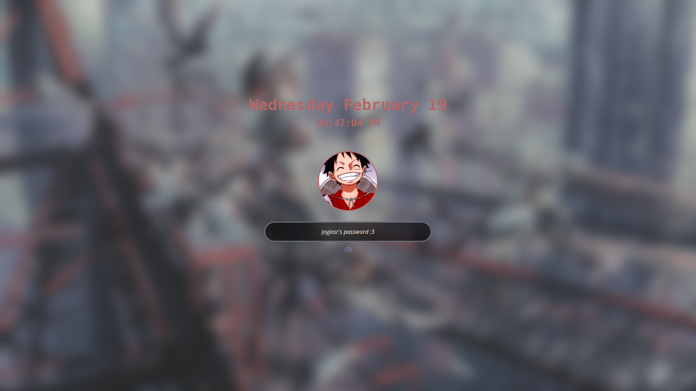
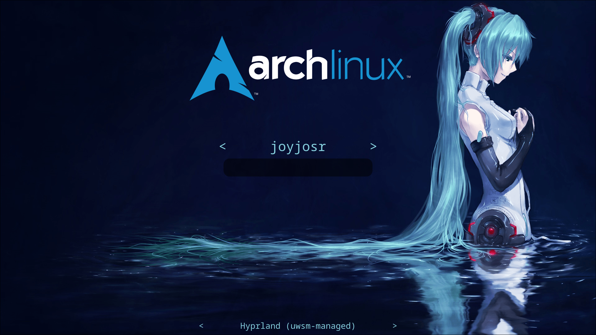

<h1 align="center">💖 Hyprlust </h1>

</img>

<h4 align="center"> Hyprland with Wallust</h4>

This configuration is for my custom [Hyprland](https://github.com/hyprwm/Hyprland) setup, featuring dynamic color schemes powered by [Wallust](https://codeberg.org/explosion-mental/wallust). Updates will be infrequent and typically only happen if something breaks. 

The included script automates the installation of packages and sets up Paru for package management.

Oh, and it's Arch BTW... just kidding (unless).

> [!WARNING]
> These are my personal dot files and may not work for everyone.
> Use at your own risk.

## 📝 Details

- **OS**: Arch Linux
- **Compositor**: [hyprland](https://github.com/hyprwm/Hyprland)
- **Terminal**: [wezterm](https://github.com/wez/wezterm)
- **Colorscheme**: [wallust](https://codeberg.org/explosion-mental/wallust)
- **Bar**: [waybar](https://github.com/Alexays/Waybar)
- **Notifications**: [swaync](https://github.com/ErikReider/SwayNotificationCenter)
- **Launcher/Powermenu/Wallpaper**: [rofi](https://github.com/lbonn/rofi)
- **SDDM Theme**: [where is my sddm theme?](https://github.com/stepanzubkov/where-is-my-sddm-theme)
- **Browser**: Firefox

## 📸 Gallery

