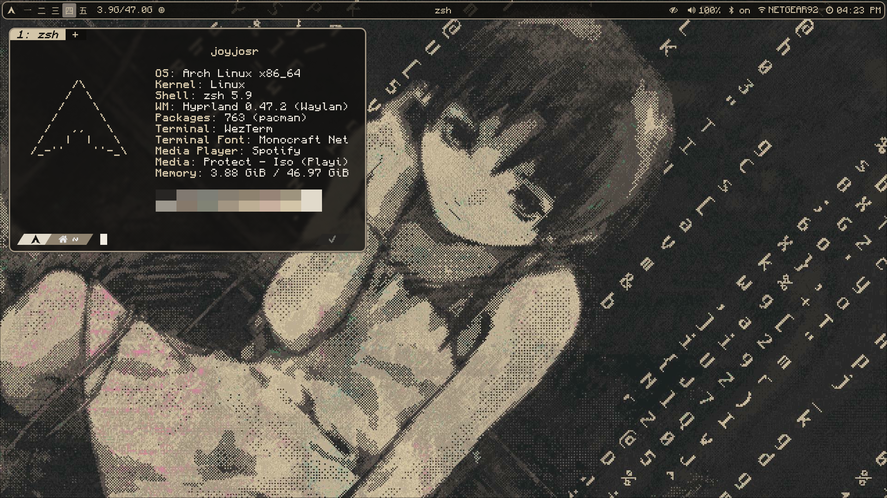
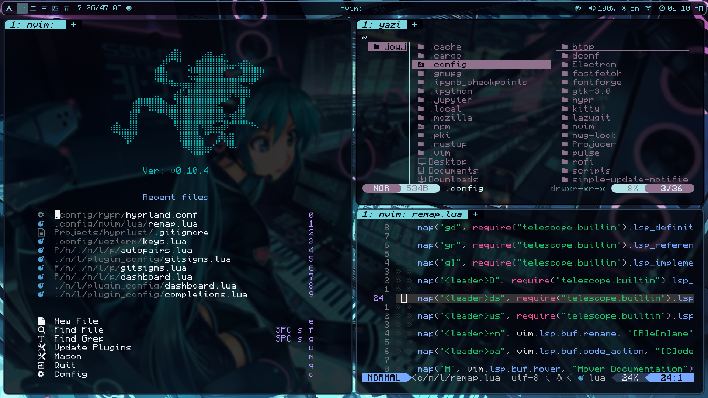
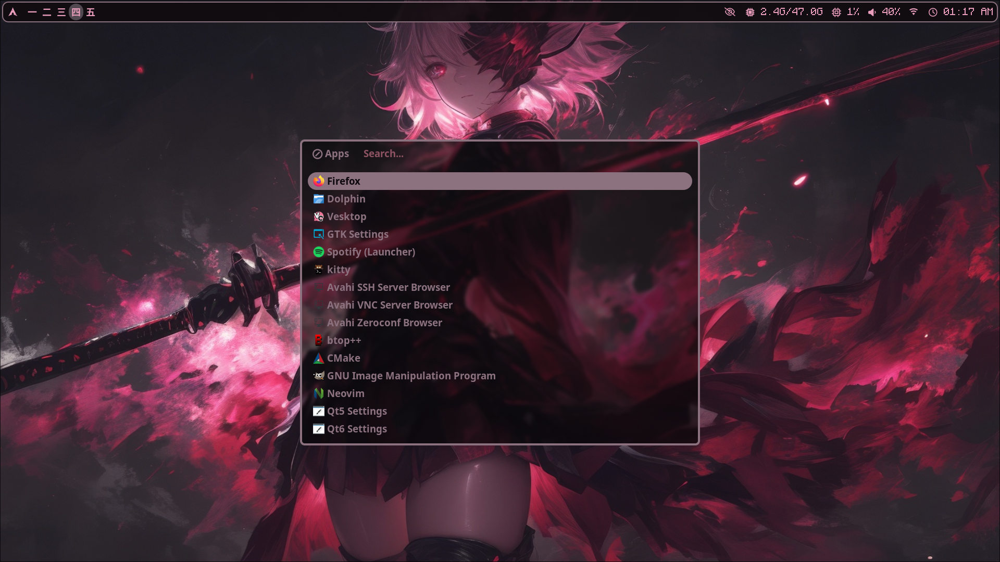
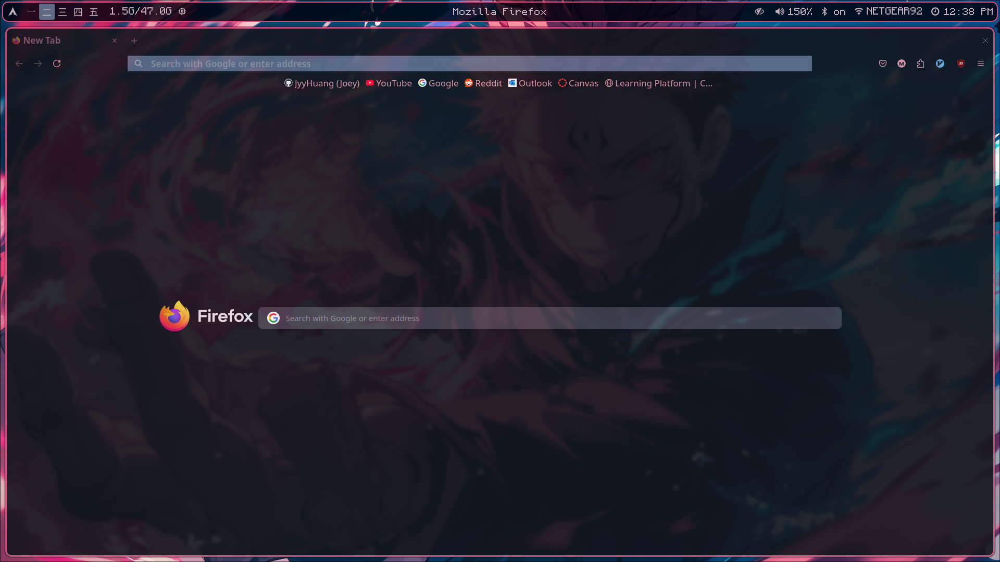
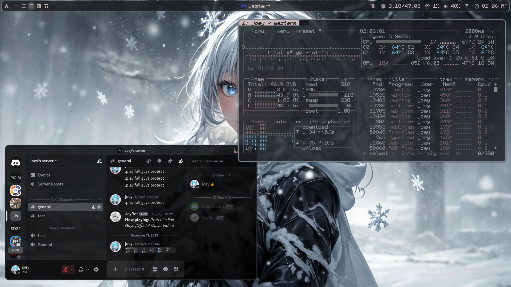
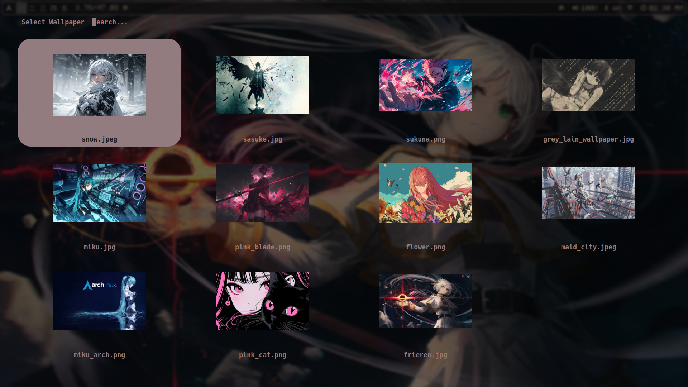
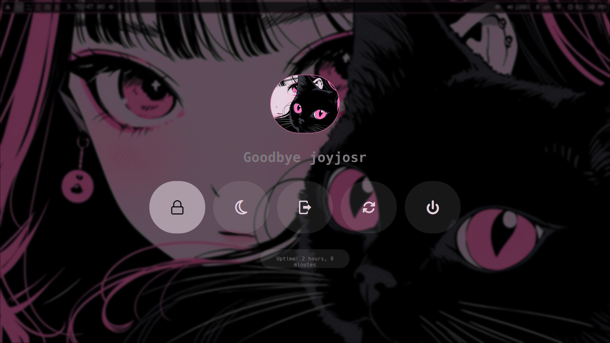
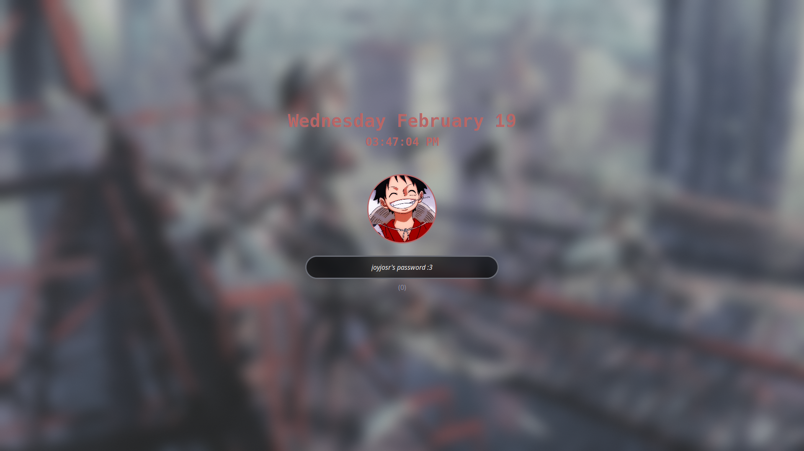

<h1 align="center">💖 Hyprlust 💖</h1>

</img>

<h3 align="center"> Hyprland with Wallust</h4>

This configuration is for my custom [Hyprland](https://github.com/hyprwm/Hyprland) setup, featuring dynamic color schemes powered by [Wallust](https://codeberg.org/explosion-mental/wallust). The included script automates the installation of packages, installs paru, copies files, and enables services. I haven't fully tested the script so you may need to set things up manually.

Oh, and it's Arch BTW... jk (unless).

> [!WARNING]
> These are my personal dot files and may not work for everyone. Packages may not be up to date, use at your own risk.

## Details

- **OS**: Arch Linux
- **Compositor**: [hyprland](https://github.com/hyprwm/Hyprland)
- **Terminal**: [wezterm](https://github.com/wez/wezterm)
- **Colorscheme**: [wallust](https://codeberg.org/explosion-mental/wallust)
- **Bar**: [waybar](https://github.com/Alexays/Waybar)
- **Launcher/Powermenu/Wallpaper**: [rofi](https://github.com/lbonn/rofi)
- **Browser**: Firefox [(textfox)](https://github.com/adriankarlen/textfox)

## Future Plans
I want to eventually port my components to [quickshell](https://quickshell.org/) and will be working on that for the time being.

## Gallery

